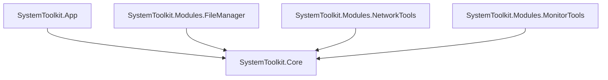

# SystemToolkit 开发文档

本文档面向项目开发者，包含技术规格、架构说明和开发指南。

<div align="center">

**邀请注册**: [MonkeyCode AI](https://monkeycode-ai.com/?ic=019e4e77-519b-70dc-82ea-2a833e5e93da)

</div>

---

## 目录

1. [项目概述](#项目概述)
2. [技术架构](#技术架构)
3. [模块说明](#模块说明)
4. [开发指南](#开发指南)
5. [编码规范](#编码规范)
6. [测试策略](#测试策略)

---

## 项目概述

SystemToolkit 是一个基于 .NET 10.0 + WPF 的 Windows 桌面应用程序，提供 6 大类 30+ 个实用工具功能。

### 开发目标
- 提供一站式系统工具解决方案
- 模块化设计，便于扩展新功能
- 遵循 MVVM 模式，代码清晰可维护
- 支持 .NET 10.0 所有新特性

---

## 技术架构

### 架构图

```
┌─────────────────────────────────────────┐
│          SystemToolkit.App              │
│              (WPF UI)                   │
├─────────────────────────────────────────┤
│             ViewModels                  │
│   (MVVM - CommunityToolkit.MVVM)        │
├─────────────────────────────────────────┤
│         SystemToolkit.Core              │
│      (Business Logic Layer)             │
├─────────────────────────────────────────┤
│         SystemToolkit.Modules           │
│  (Feature Modules - Optional)           │
└─────────────────────────────────────────┘
```

### 分层说明

#### 1. 表示层 (SystemToolkit.App)
- WPF 应用主程序
- XAML 视图和 UI 逻辑
- ViewModels 和 DataTemplates

#### 2. 业务逻辑层 (SystemToolkit.Core)
- 核心业务模型
- 服务接口和实现
- 工具类和扩展方法

#### 3. 功能模块层 (SystemToolkit.Modules)
- 可选的功能模块
- 按功能领域分离
- 支持独立开发和测试

### 依赖关系



---

## 模块说明

### SystemToolkit.Core

核心服务包括：

#### 文件服务 (FileService)
```csharp
public interface IFileService
{
    Task<List<FileItem>> GetFilesAsync(string directory, bool recursive = false);
    Task<List<DuplicateFile>> FindDuplicateFilesAsync(string directory, CancellationToken ct = default);
    Task BatchRenameAsync(List<FileItem> files, RenameRule rule, CancellationToken ct = default);
}
```

#### 注册表服务 (RegistryService)
- 支持 HKCU/HKLM 等根键操作
- 备份到 .reg 文件
- 查找无效注册表项

#### 进程服务 (ProcessService)
- 进程枚举和信息获取
- 进程终止和优先级设置
- 资源占用统计

#### 网络服务 (NetworkService)
- Ping 功能
- 端口扫描
- HTTP 请求测试
- 路由追踪

#### 监控服务 (MonitorService)
- 使用 PerformanceCounter
- CPU/内存/磁盘/网络监控
- 告警和阈值设置

### SystemToolkit.Modules

每个模块包含：
- 领域模型
- 业务服务扩展
- UI 组件 (可选)

---

## 开发指南

### 1. 添加新功能

#### 步骤 1: 在 Core 层添加服务接口

```csharp
// SystemToolkit.Core/Services/IYourService.cs
public interface IYourService
{
    Task<YourResult> DoSomethingAsync(string input);
}
```

#### 步骤 2: 实现服务

```csharp
// SystemToolkit.Core/Services/YourService.cs
public class YourService : IYourService
{
    public async Task<YourResult> DoSomethingAsync(string input)
    {
        // 实现逻辑
    }
}
```

#### 步骤 3: 添加 ViewModel

```csharp
// SystemToolkit.App/ViewModels/YourFeatureViewModel.cs
public class YourFeatureViewModel : ObservableObject
{
    private readonly IYourService _service;
    
    public YourFeatureViewModel(IYourService service)
    {
        _service = service;
    }
}
```

#### 步骤 4: 创建 View

```xml
<!-- SystemToolkit.App/Views/YourFeatureView.xaml -->
<UserControl x:Class="SystemToolkit.App.Views.YourFeatureView">
    <!-- UI 定义 -->
</UserControl>
```

#### 步骤 5: 注册到菜单

编辑 `MainViewModel.cs`:

```csharp
MenuItems.Add(new MenuItemViewModel
{
    Name = "🔧 你的功能",
    Children = new List<MenuItemViewModel>
    {
        new() { Name = "功能名称", ViewType = typeof(YourFeatureView) }
    }
});
```

### 2. 使用依赖注入

在 `App.xaml.cs` 中配置：

```csharp
public partial class App : Application
{
    private readonly IHost _host;

    public App()
    {
        _host = Host.CreateDefaultBuilder()
            .ConfigureServices((context, services) =>
            {
                // 注册服务
                services.AddSingleton<IFileService, FileService>();
                services.AddSingleton<INetworkService, NetworkService>();
                services.AddSingleton<IMonitorService, MonitorService>();
            })
            .Build();
    }
}
```

### 3. 异步编程规范

- 所有 I/O 操作必须使用异步
- 使用 `CancellationToken` 支持取消
- UI 线程使用 `Dispatcher.Invoke`

```csharp
public async Task<List<FileItem>> GetFilesAsync(CancellationToken ct = default)
{
    return await Task.Run(() =>
    {
        // CPU 密集型操作
    }, ct);
}
```

---

## 编码规范

### C# 代码风格

遵循 [.NET Foundation Coding Guidelines](https://github.com/dotnet/runtime/blob/main/docs/coding-guidelines/coding-style.md)

#### 命名约定
```csharp
// 类名 - PascalCase
public class FileService { }

// 接口 - I 前缀 + PascalCase
public interface IFileService { }

// 方法 - PascalCase
public async Task<List<FileItem>> GetFilesAsync() { }

// 私字段 - _camelCase
private readonly IFileService _fileService;

// 参数 - camelCase
public void ProcessFiles(List<FileItem> files) { }
```

#### 异步规范
```csharp
// ✅ Good
public async Task<string> GetDataAsync(CancellationToken ct = default)

// ❌ Bad
public async void GetData()  // 避免 async void
public Task GetData()        // 返回 Task 而非 void
```

#### 错误处理
```csharp
try
{
    await OperationAsync();
}
catch (SpecificException ex)
{
    // 记录具体异常
    _logger.LogError(ex, "Operation failed");
    throw;
}
```

### XAML 规范

#### 资源定义
```xml
<UserControl.Resources>
    <Style x:Key="PrimaryButtonStyle" TargetType="Button">
        <Setter Property="Background" Value="#007ACC"/>
        <Setter Property="Foreground" Value="White"/>
    </Style>
</UserControl.Resources>
```

#### 数据绑定
```xml
<!-- ✅ Good - TwoWay binding with UpdateSourceTrigger -->
<TextBox Text="{Binding FileName, UpdateSourceTrigger=PropertyChanged}"/>

<!-- ❌ Bad - Default UpdateSourceTrigger=LostFocus -->
<TextBox Text="{Binding FileName}"/>
```

---

## 测试策略

### 单元测试

使用 xUnit 和 Moq:

```csharp
public class FileServiceTests
{
    [Fact]
    public async Task GetFilesAsync_ReturnsFiles()
    {
        // Arrange
        var service = new FileService();
        
        // Act
        var files = await service.GetFilesAsync("C:\\Test");
        
        // Assert
        Assert.NotEmpty(files);
    }
}
```

### 集成测试

测试完整功能流程:

```csharp
[Fact]
public async Task FullRenameWorkflow()
{
    // 测试从 UI 到服务层的完整流程
}
```

### 手动测试清单

每个功能模块需要手动验证：
- [ ] 正常流程
- [ ] 边界情况
- [ ] 错误处理
- [ ] 权限要求
- [ ] UI 响应性

---

## 构建和发布

### Debug 构建

```bash
dotnet build -c Debug
```

### Release 构建

```bash
dotnet build -c Release
```

### 单文件发布

```bash
dotnet publish SystemToolkit.App \
  -c Release \
  -r win-x64 \
  --self-contained true \
  -p:PublishSingleFile=true \
  -p:IncludeNativeLibrariesForSelfExtract=true
```

### 安装包制作

建议使用 WiX Toolset 或 Inno Setup 制作用于分发的安装包。

---

## 性能优化建议

1. **大文件列表**: 使用虚拟化 (VirtualizingStackPanel)
2. **耗时操作**: 始终在后台线程 + 进度反馈
3. **内存管理**: IDisposable 资源及时释放
4. **UI 响应**: 避免在 UI 线程执行耗时操作

---

## 常见问题

### Q: 如何处理需要管理员权限的功能？

```csharp
var psi = new ProcessStartInfo
{
    FileName = "command.exe",
    Verb = "runas",  // 请求提升权限
    UseShellExecute = true
};
Process.Start(psi);
```

### Q: 如何获取进程文件路径？

```csharp
try
{
    return process.MainModule?.FileName;
}
catch (Win32Exception)
{
    // 某些系统进程无法访问
    return null;
}
```

### Q: PerformanceCounter 权限问题？

对于某些系统计数器需要管理员权限，可以提供备选方案：
```csharp
try
{
    return performanceCounter.NextValue();
}
catch (UnauthorizedAccessException)
{
    return FallbackValue();
}
```

---

## 更新日志

### v1.0.0 (2026-01-XX)
- 初始版本发布
- 包含所有 6 大类功能模块
- 基础文件管理、网络工具、系统监控

---

<div align="center">

**邀请注册**: [MonkeyCode AI](https://monkeycode-ai.com/?ic=019e4e77-519b-70dc-82ea-2a833e5e93da)

开发文档版本：1.0.0 | 最后更新：2026-01-XX

</div>
